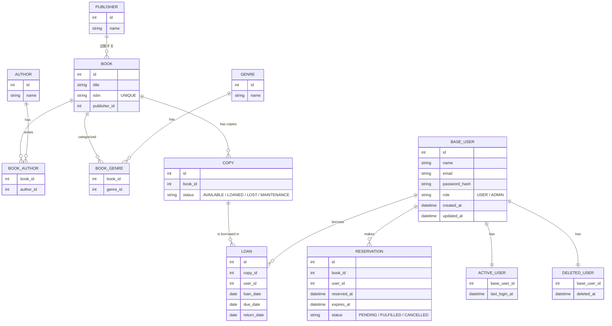

```mermaid
erDiagram
    BOOK {
        int id
        string title
        string isbn "UNIQUE"
        int publisher_id
    }
    PUBLISHER {
        int id
        string name
    }
    AUTHOR {
        int id
        string name
    }
    BOOK_AUTHOR {
        int book_id
        int author_id
    }
    GENRE {
        int id
        string name
    }
    BOOK_GENRE {
        int book_id
        int genre_id
    }
    COPY {
        int id
        int book_id
        string status    "AVAILABLE / LOANED / LOST / MAINTENANCE"
    }
    LOAN {
        int id
        int copy_id
        int user_id
        date loan_date
        date due_date
        date return_date
    }
    RESERVATION {
        int id
        int book_id
        int user_id
        datetime reserved_at
        datetime expires_at
        string status "PENDING / FULFILLED / CANCELLED"
    }
    BASE_USER {
        int id
        string name
        string email
        string password_hash
        string role       "USER / ADMIN"
        datetime created_at
        datetime updated_at
    }
    ACTIVE_USER {
        int base_user_id
        datetime last_login_at
    }
    DELETED_USER {
        int base_user_id
        datetime deleted_at
    }

    BOOK ||--o{ BOOK_AUTHOR : "has"
    AUTHOR ||--o{ BOOK_AUTHOR : "writes"
    BOOK ||--o{ BOOK_GENRE : "categorized"
    GENRE ||--o{ BOOK_GENRE : "has"
    PUBLISHER ||--o{ BOOK : 出版する
    BOOK ||--o{ COPY : "has copies"
    COPY ||--o{ LOAN : "is borrowed in"
    BASE_USER ||--o{ LOAN : "borrows"
    BASE_USER ||--o{ RESERVATION : "makes"
    BASE_USER ||--|| ACTIVE_USER : has
    BASE_USER ||--|| DELETED_USER : has
```
