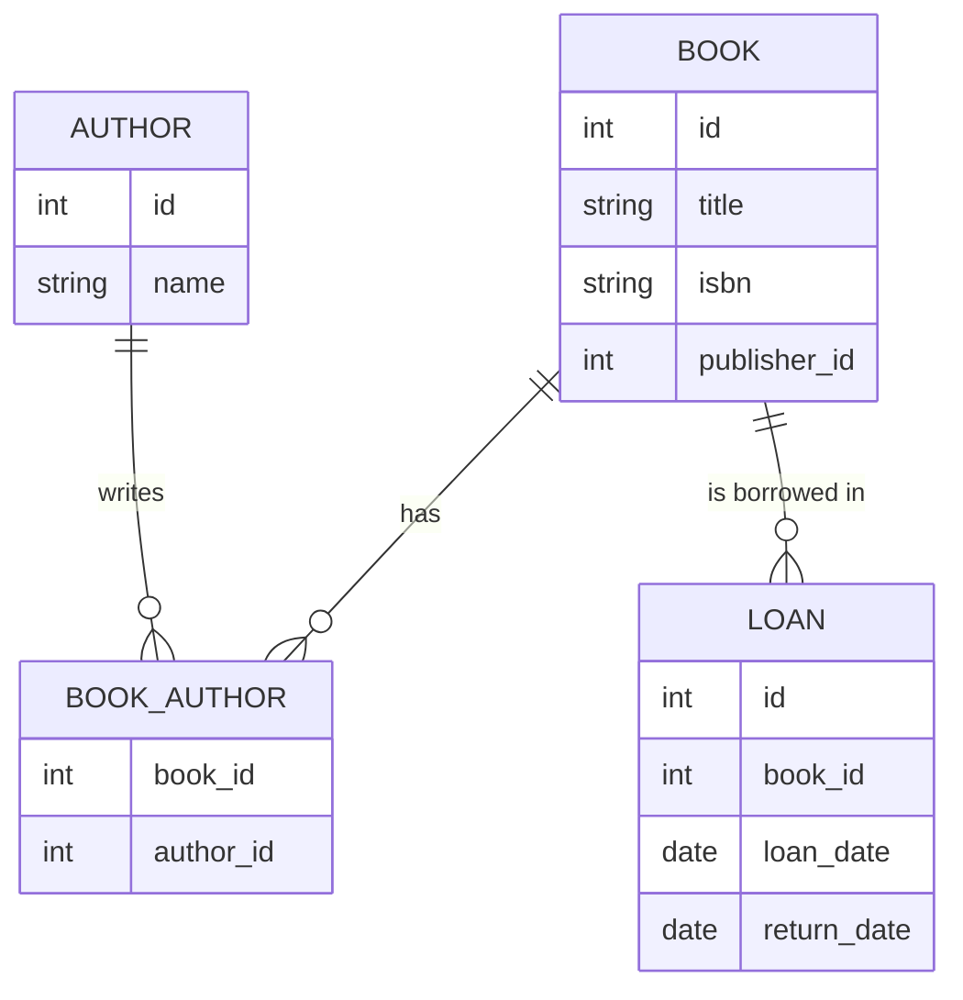

```mermaid
erDiagram
    BOOK {
        int id
        string title
        string isbn
        int publisher_id
    }
    AUTHOR {
        int id
        string name
    }
    BOOK_AUTHOR {
        int book_id
        int author_id
    }
    LOAN {
        int id
        int book_id
        date loan_date
        date return_date
    }

    BOOK ||--o{ BOOK_AUTHOR : "has"
    AUTHOR ||--o{ BOOK_AUTHOR : "writes"
    BOOK ||--o{ LOAN : "is borrowed in"
```
